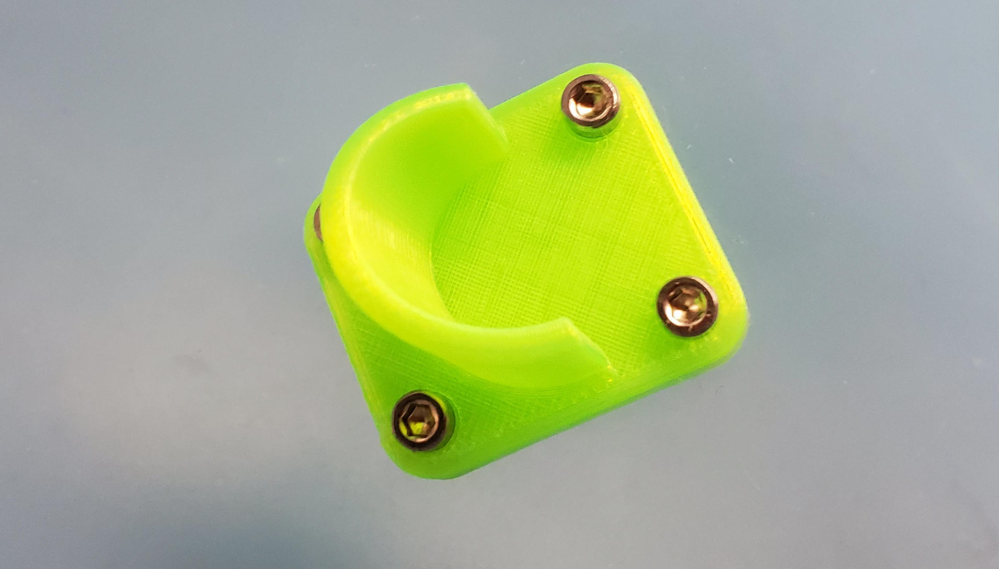
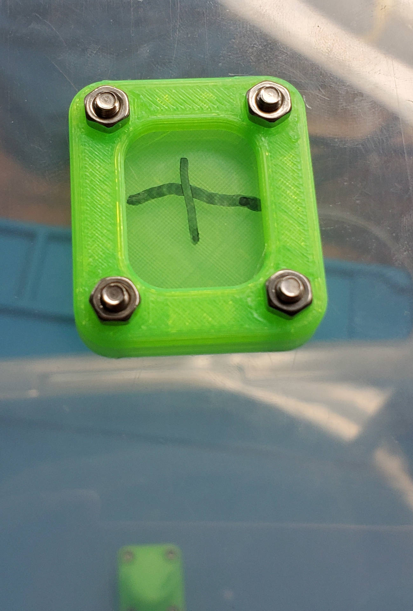

# 0.75in (19mm) dowel holder for a drybox

I don't have much to say about this. I needed a mounting bracket for a dry box I was making. I wanted to reuse a dowel I already had lying about but I couldn't find a bracket that was quite what I needed.

The outside piece helps reenforce, provide air blocking, and to provide shallow recesse for the nuts to stop them turning during tightening.

Printing:

* 0.2mm layer height
* 3 parimeters
* 10% infill
* MatterHackers translucent neon green Pro Series PLA
