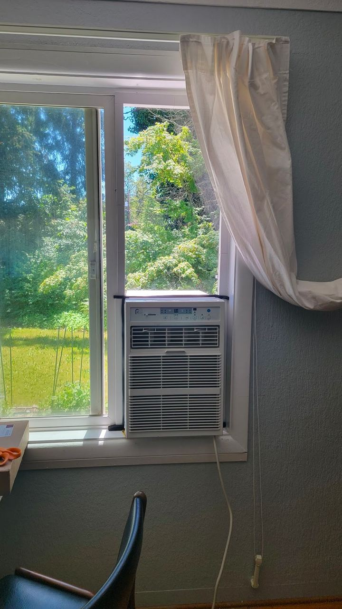

# AC Window Unit Spacer Insert

Our house has a pretty great place for a window unit, but the window is a way too tall for the unit to fit in. For a couple of years we used a sad combination of a piece of melamine and the spacer that came with the unit. It was a bit of a pain to put together, a bit of a pain to take apart, and it blocked a lot of light. I decided I wanted to be able to use two pieces of plexiglass to make a better spacer that lets in light and offers at least a bit of insulation.

This puts the two pieces of plexi in a double layer with a couple centimeters of airspace between them. I designed the frame to have a channel all the way around for the plexi to slot into. The frame then wraps around the sill on the top and sides, a place where we can put a but of foam insulation. There are also screw holes in the back, and clips that tension the whole frame into the window.

The window hole I had to fill it WAY bigger than the size of my printbed. I had to build in some joinery so that I could print the frame in many pieces. This also have me a little leeway since I new my pre-design measurements were going to be off a bit (long story). In the end I was off by more than my leeway would allow but I was able to make it work with some field adjustments.

The insulating effect was better than expected. The unit was able to run less this last summer and the decrease in noise was noticeable.

I know for this model to be useful to anyway I should give measurements and whatnot. But just assume it's not going to work for you. This was a fun project but a 3D printer wasn't the best tool for the job... it was just the best tool I had. This is really be committed for posterity.

