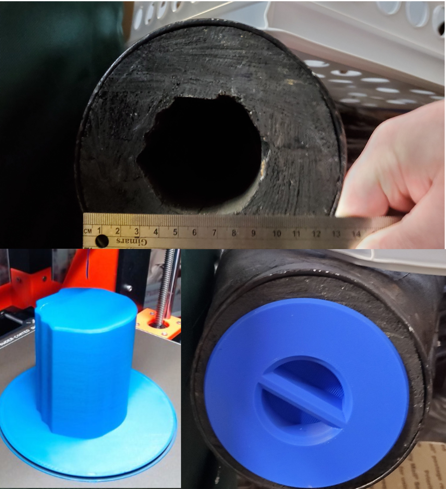

# Bellow Coffee Table Cap

In the 1960's my grandfather turned an forge bellows into a coffee table. It's the only piece of furniture I've ever been enamored with but we don't currently have space for it. While it's spending time being stored away I want to make sure no critters decide it looks like a good place to call home.

The bellows were handmade, and the orifice isn't a smooth circle. In order to make a plug that would fit snugly all around the way around I took a number of photos with a ruler in frame. By taking a photo perpendicular to the face with a ruler in shot, I was able to size the image in fusion and trace around it. I put a slight taper on the shape to give myself some leeway, but in the end the measurement process was perfect.

#### Print Settings

* 0.3mm layer height
* 10% support cubic infill

Lighting infill would also work.
