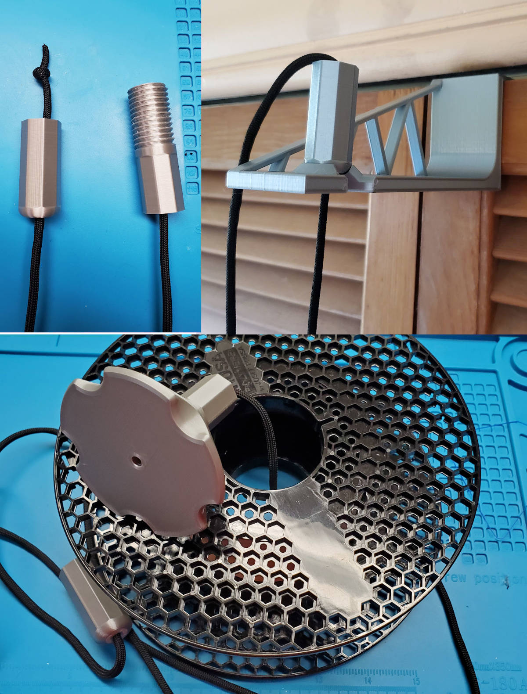
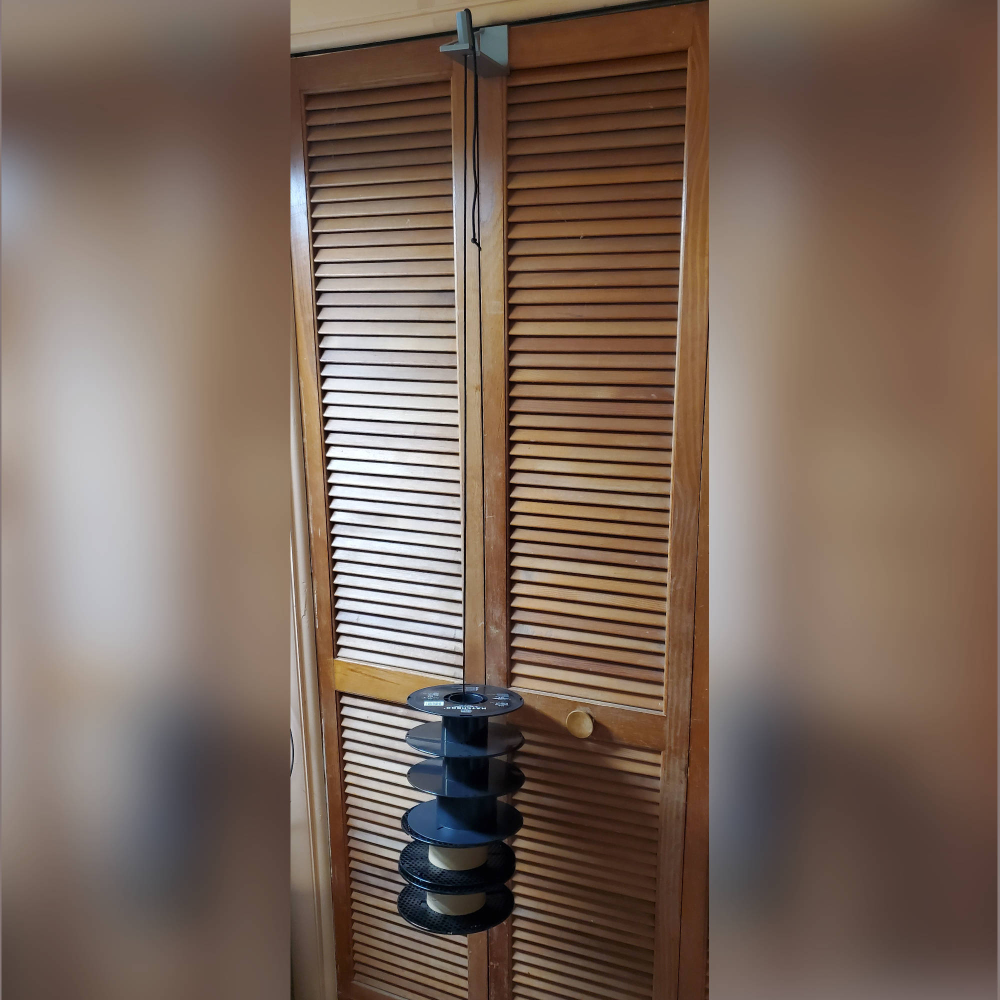

# Empty Spool Door Hanger

An over-the-door storage system for empty filament spools. I designed this specifically for the bifold closet doors in my maker space. The hanger needs > 3mm of clearance at the top and 7.5mm behind so it will not work with most doors. It will accommodate a 30mm door. Everything is designed with 0.15mm of clearance.

I wanted to be able access the spools from either end to make it as easy as possible to get to a specific spool. The top shaft lifts off and the bottom screws together. Empty filament spools seem to average about 250g so I fully expect creep to set in, I'm keeping an eye on how fast it happens with PLA.

Printing:

* 0.2mm layers
* 0.4mm nozzle
* 3 perimeters
* 20% infill

Post-Printing

There is a single sacrificial layer on the top shaft so it can print with contiguous bridging and doesn't require supports. I used a drill bit to clear out the cord path.
