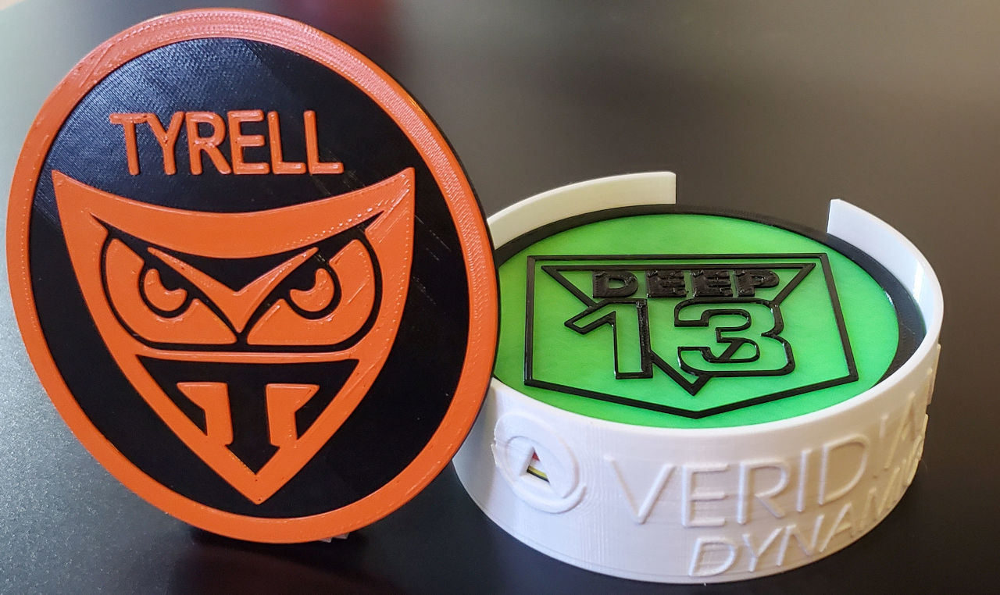

# EvilCorp Coaster Collection

I made a collection of coasters of malevolent corporate logos from my favorite shows and movies. Or at least the ones that would work in two colors on a round disc.

Each coaster is 100mm in diameter. Color change is via filament swap. The embossing is 0.6mm so it's 3 layers at 0.2mm or 4 layers at 0.15mm layer heights. That height limits any wobble your drinkware may incur from the non-flat surface.

Included Coasters:

* [Blue Sun Corporation from Firefly / Serenity](photos/bluesun.jpg)
* [Buy N Large from Wall-E](photos/b&l.jpg)
* [Cyberdyne Systems from Terminator](photos/cyberdyne.jpg)
* [Deep 13 from Mystery Science Theater 3000](photos/deep13.jpg)
* [Hampton DeVille from Corperate](photos/hamptondeville.jpg)
* [MomCorp from Futurama](photos/momcorp.jpg)
* [Omni Consumer Products from RoboCop](photos/ocp.jpg)
* [Tyrell Corporation from Blade Runner](photos/tyrell.jpg)
* [Weyland-Yutani from Alien](photos/weyland.jpg)

In addition to the coasters I made a coaster holder that has the Veridian Dynamics logo from Better Off Ted embossed on the front.

Printing:

* 0.2mm layer height
* 0.4mm nozzle
* Various filaments (all PLA)
