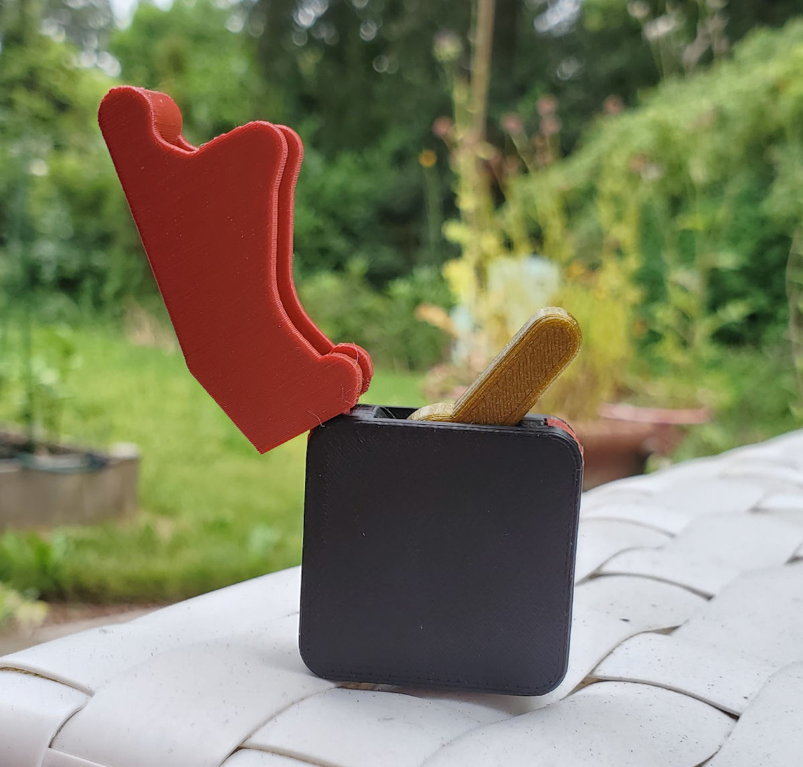

# Fidget Switch: Missile Command Edition

This is a remix of the [Fidget Toggle Switch](https://www.printables.com/model/87042-fidget-toggle-switch) by [kriswillcode](https://www.printables.com/social/153223-kriswillcode/about).

I designed the cover and the corner filler and altered the case to accomidate them. The switch and springs are directly from kriswillcode's model.

## Print Settings

### What to print

- 2x of the Case halves
- 1x Cover
- 1x Corner Filler (Optional)
- Spring of your choice
  - I recommend printing all 3 and trying them

### Settings

As shown this was printed with a 0.4mm nozzle but it should print fine with a 0.6mm nozzle and a slicer with [Arachne](https://www.hta3d.com/en/blog/arachne-engine-the-engine-perimeter-generator-that-comes-to-revolutionize-our-3d-prints).

- Layer Height: 0.2mm
- Infill: 10% of 15%
- Supports: None

## Assembly

I recommend assembling everything into one half of the case (2), then place the other case half on top of the assembly (3) as pictured. 

- Add your spring of choice and the toggle switch to one of the case halves
- Add the switch cover to the corner you like best so it will cover the toggle switch
- Add the Corner Filler to the loser corner.
- Sandwich the other case half on top.

---

Note: Unlike most of the models in this repo, this is Licensed:

Shield: [![CC BY-NC-SA 4.0][cc-by-nc-sa-shield]][cc-by-nc-sa]

This work is licensed under a
[Creative Commons Attribution-NonCommercial-ShareAlike 4.0 International License][cc-by-nc-sa].

[![CC BY-NC-SA 4.0][cc-by-nc-sa-image]][cc-by-nc-sa]

[cc-by-nc-sa]: http://creativecommons.org/licenses/by-nc-sa/4.0/
[cc-by-nc-sa-image]: https://licensebuttons.net/l/by-nc-sa/4.0/88x31.png
[cc-by-nc-sa-shield]: https://img.shields.io/badge/License-CC%20BY--NC--SA%204.0-lightgrey.svg