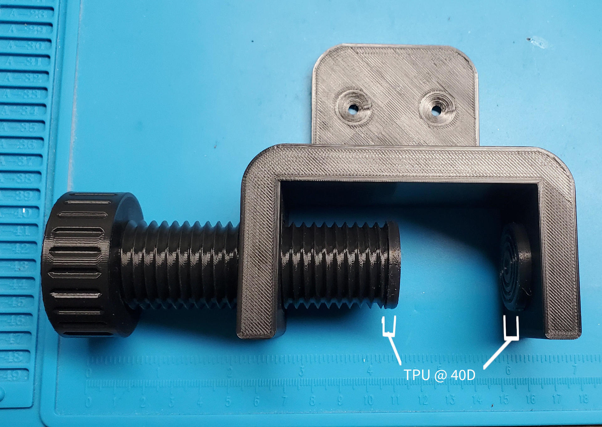
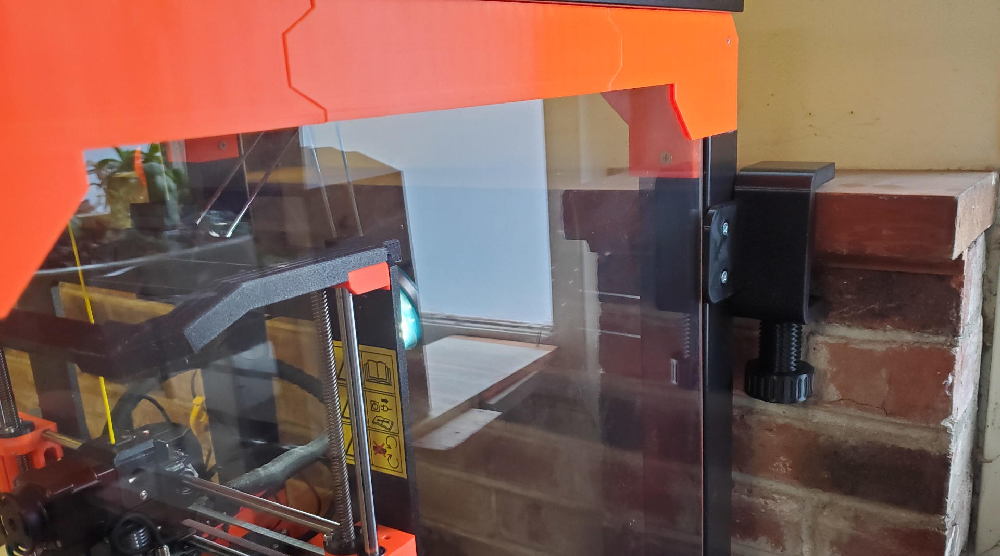

# Mantle Clamp / Ikea Lack Enclosure Mount

I made my Ikea Lack enclosure 3 Lacks tall. It means less bending to work with my printer, but it also allows for a lot of wobble. The enclosure sits in front of a stove mantle in our garage so I made a mounting bracket that could clamp to it without damage. To help dampen the vibrations I added press fit pads printed in 40D TPU.

You need 2 of the TPU pads, one fore the clamp and one for the screw. You should screw the screw partway in before adding its TPU pad.

It's doing great so far. The wobble is gone and vibration is at a minimum. I expect the clamp to creep over time but that it will take a long time before it's catastrophic.

Printing:

* Clamp and Screw
  * 0.15mm layers
  * 0.4 mm nozzle
  * 3 perimeters
  * 5% infill
  * Hatchbox black PLA
* TPU Pad
  * 0.15mm layers
  * 0.4 mm nozzle
  * 3 perimeters
  * 15% infill
  * Filatech black FilaFlex40
