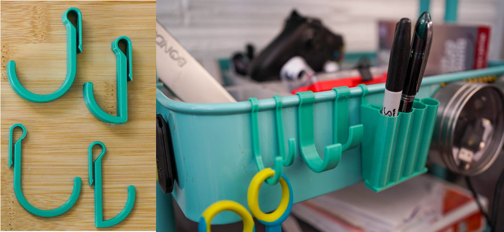
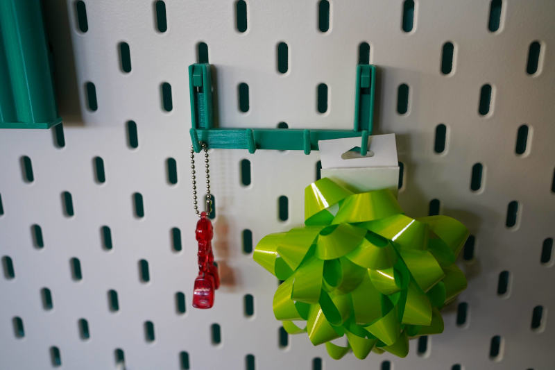
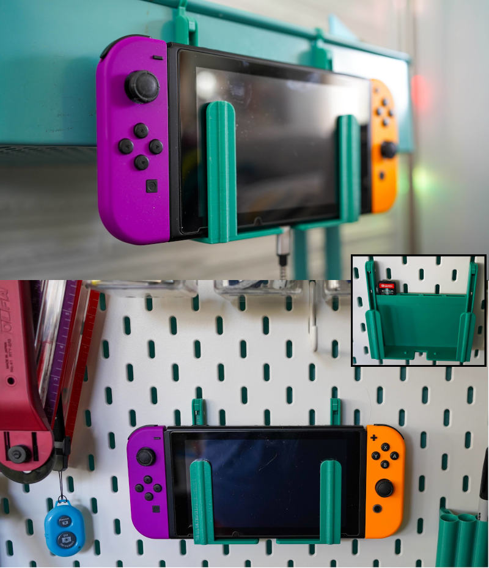
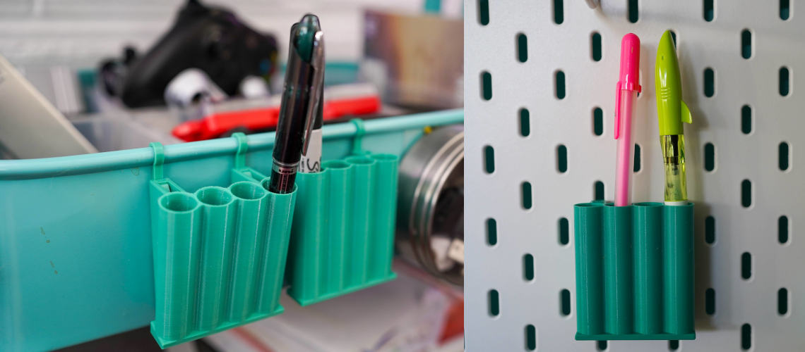
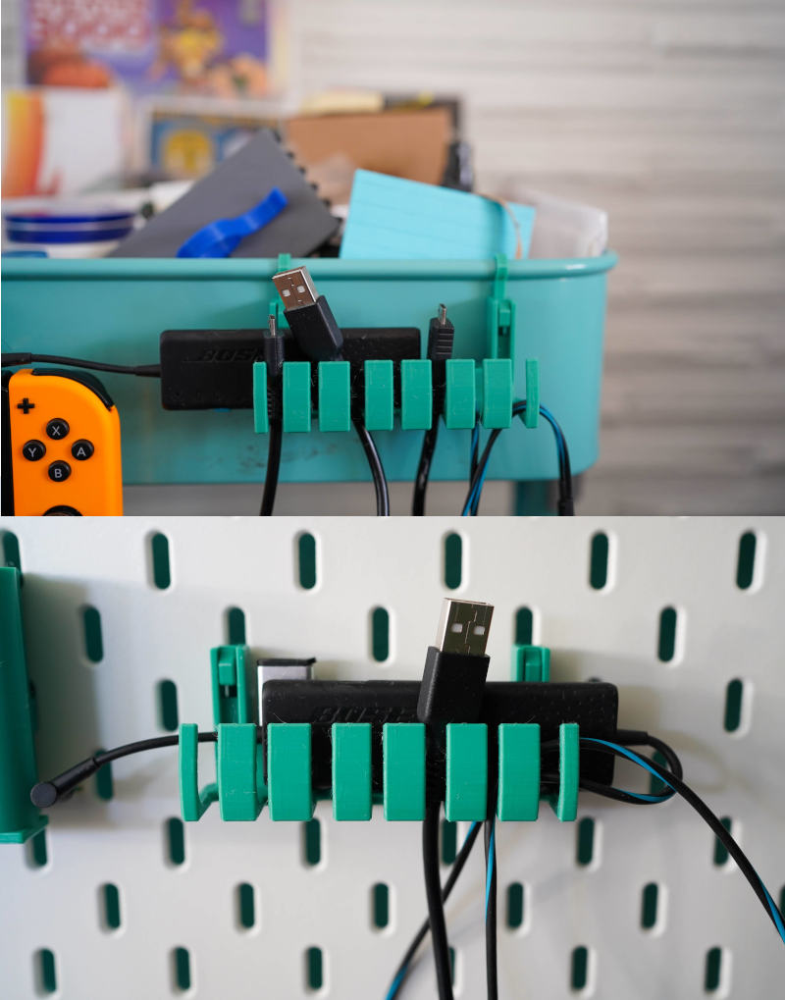

# Ikea Raskog Organization Collection

A collection of organizational accessories for the Ikea Raskog.

There are a variety of accessories including the items in the [Skadis Universal Hook Set](https://www.thingiverse.com/thing:2853257) (which is not my design). Like that collection this is easy to print (no supports), easy to assemble with no glue, strong, and stable.

## One Piece Hooks

###### *Note:* Since these are are single pieces they are not compatible with the Skadis pegboards or that hook set.

### Features

* Four varieties
  * Narrow Half-Round
  * Narrow Quarter-Round
  * Wide Half-Round
  * Wide Quarter-Round

## Hook Row

### Features

* Four small diameter hooks.

### Requires

* 2 Universal Hooks

## Nintendo Switch Holder

### Features

* Can hold the Switch while a USB cable is attached.
* Holds the console with or without the Joycons attached.
* Stabilizers to guard against side-to-side movement.
* Four game cart slots behind the switch.
* There's some extra depth to the console slot, to allow you to add something like this to the front forks to help guard against screen scratches. The forks are 18mm wide.

### Requires

* 2 Universal Hooks.

## Pen Holders

### Features

* Two versions:
  * Vertical
  * 22° Angled Version
* Holds four pens.

### Requires

* 2 Universal Hooks.

## USB Cable Holder

### Features

* Four wide cable slots.
* Three narrow cable slots.
* Two USB-A slots.
  * For thumbdrives and such.
* One USB-C slot.
* Deep tray for holding widgets.

### Requires

* 2 Universal Hooks.

# Print Settings

*As Pictured*

* 0.4mm Nozzle
* 0.15mm layer height
* 10% infill
* 3 perimeters
* PLA
  * Printed Solid Jessie
  * Feta Green
