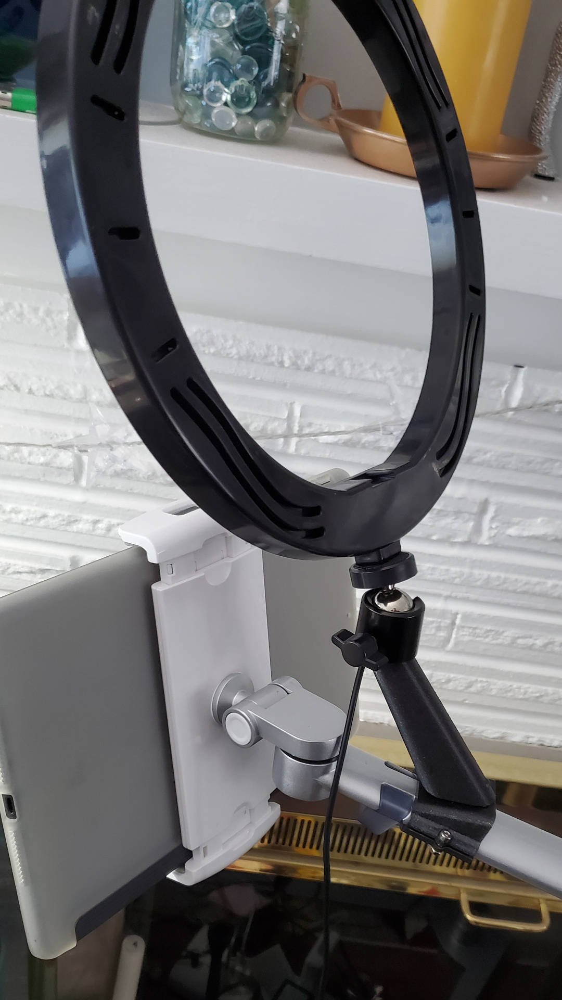
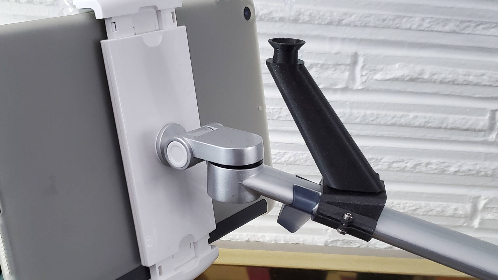
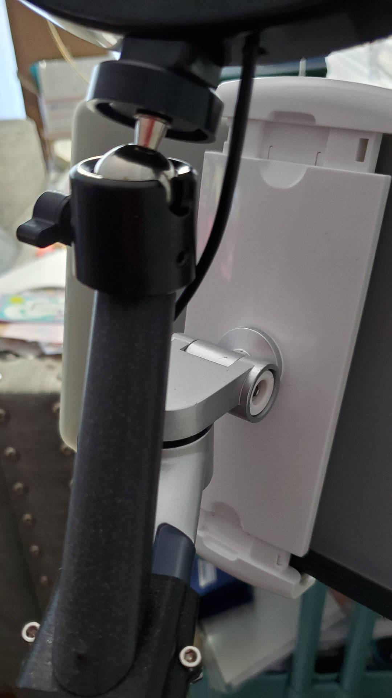

# Tablet Stand Light Adaptor

This was a request from my wife, who wanted a way to make her ring light (Yesker 10) work with her tablet stand (Viozon Model UP-6A).The challenge was to keep it as close as possible to the tablet without obstructing any of the axes of motion.

I replicated the flange for the 360 degree mount that was included with the light. With that built into my model I can make use of the ball joint for maximum flexibility.

Also included (stl only, not pictured) is a vertical mount. It worked but left the light further from the tablet than is ideal.
