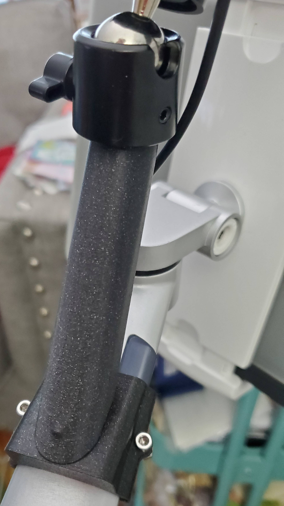

# Tablet Stand Light Adaptor

This was a request from my wife, who wanted a way to make her ring light (Yesker 10 inch) work with her tablet floor stand (Viozon Model UP-6A).The challenge was to keep the light as close as possible to the tablet without obstructing any of the stand's axes of motion.

I replicated the flange for the 360 degree mount that was included with the light. With that built into my model I can make use of the ball joint for maximum flexibility.

Also included (stl only, not pictured) is a vertical mount. It worked but left the light further from the tablet than is ideal.

This is far from perfect, but its not worth scrapping this workable version to fix the issues. Had I to do it over again I would have used hex huts in the bracket instead of brass inserts. The arm clamp also needs a bit more clearance, but the flexibility of PETG makes it work as is. And, while it's not in the original part that I based this off of, I would have added a small recess for the ball joint's grub screw to remove some play from the assembly.
